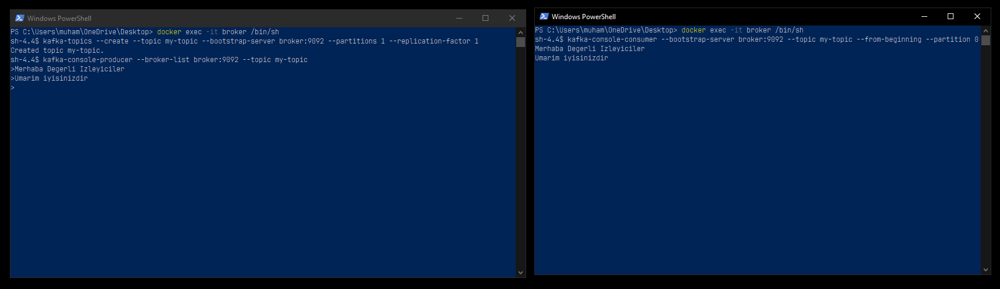
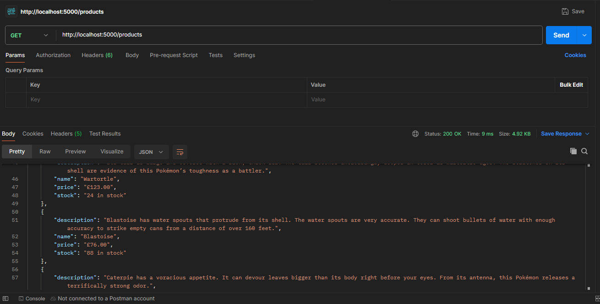

# Digital-Brain-Technologies-Task

Digital Brain Technologies ML Engineer Task

## Görev 1: Kafka Kurulumu ve Mesaj Gönderme

### Adım 1: Docker ile Kafka ve Zookeeper Kurulumu

Öncelikle, Kafka ve Zookeeper'ı Docker kullanarak kurmamız gerekiyor. Bunun için aşağıdaki `docker-compose.yml` dosyasını kullanın:

```yaml
version: '2'
services:
  zookeeper:
    image: confluentinc/cp-zookeeper:7.3.0
    container_name: zookeeper
    environment:
      ZOOKEEPER_CLIENT_PORT: 2181
      ZOOKEEPER_TICK_TIME: 2000

  broker:
    image: confluentinc/cp-kafka:7.3.0
    container_name: broker
    ports:
      - "9092:9092"
    depends_on:
      - zookeeper
    environment:
      KAFKA_BROKER_ID: 1 
      KAFKA_ZOOKEEPER_CONNECT: 'zookeeper:2181'
      KAFKA_LISTENER_SECURITY_PROTOCOL_MAP: PLAINTEXT:PLAINTEXT, PLAINTEXT_INTERNAL:PLAINTEXT
      KAFKA_ADVERTISED_LISTENERS: PLAINTEXT://localhost:9092,PLAINTEXT_INTERNAL://broker:29092
      KAFKA_TRANSACTION_STATE_LOG_MIN_ISR: 1
      KAFKA_TRANSACTION_STATE_LOG_REPLICATION_FACTOR: 1
```

Docker servislerini başlatmak için aşağıdaki komutu kullanın:

```sh
docker-compose up -d
```

### Adım 2: Kafka Konusu (Topic) Oluşturma

Kafka CLI komutlarını kullanarak bir konu oluşturun. Öncelikle, broker konteynerine bağlanın:

```sh
docker exec -it broker /bin/sh
```

Ardından, aşağıdaki komutu kullanarak bir Kafka konusu oluşturun:

```sh
kafka-topics --create --topic my-topic --bootstrap-server broker:9092 --partitions 1 --replication-factor 1
```

### Adım 3: Kafka Konusuna Mesaj Gönderme

Oluşturduğunuz konuya mesaj göndermek için aşağıdaki komutu kullanın:

```sh
kafka-console-producer --broker-list broker:9092 --topic my-topic
```

Komut çalıştırıldıktan sonra, konsolda mesajlarınızı yazabilirsiniz. Örneğin:

```sh
> Merhaba sayin izleyici
> Umarim dogru olmustur
```

### Adım 4: Kafka Konusundan Mesaj Dinleme

```sh
kafka-console-consumer --bootstrap-server broker:9092 --topic my-topic --from-beginning --partition 0
```

### Ornek Resim



## Görev 2: Veri Kazıma, Kafka Entegrasyonu ve REST API

### Adım 1: Veri Kazıma ve Verileri Dosyaya Kaydetme
[Scrapeme](https://scrapeme.live/shop/) adresinin ilk sayfasındaki verileri kazıyın ve kazınan verileri 1 saniyelik aralıklarla Kafka konusuna gönderin. Kafka konusuna alınan verileri `products_data.json` adlı bir dosyaya kaydedin.
```
data_scraper.py
```
### Adım 2: Veri Kazıma ve Verileri Dosyaya Kaydetme
Flask kullanarak `products_data.json` dosyasındaki verileri sunmak için bir REST API oluşturun.
```
app.py
```
### Ornek Resim



## Task 3: Çözümü Dockerize Edin
### Adım 1: Gereksinimler dosyasi olusturma
requirements.txt:
```txt
Flask
confluent_kafka
requests
beautifulsoup4
```
### Adım 2: Dockerfile

```Dockerfile
FROM python:3.9-slim

# Set the working directory
WORKDIR /app

# Install dependencies
RUN apt-get update && apt-get install -y gcc libc-dev

# Copy all files to the container
COPY . .

# Install Python dependencies
RUN pip install -r requirements.txt

# Run both the scraper and the Flask app
CMD ["sh", "-c", "python data_scraper.py && python app.py"]
```
### Adım 3: docker-compose.yml

```yml
version: '2'
services:
  zookeeper:
    image: confluentinc/cp-zookeeper:7.3.0
    container_name: zookeeper
    environment:
      ZOOKEEPER_CLIENT_PORT: 2181
      ZOOKEEPER_TICK_TIME: 2000
    healthcheck:
      test: ["CMD", "echo", "ruok", "|", "nc", "localhost", "2181"]
      interval: 30s
      timeout: 10s
      retries: 5

  broker:
    image: confluentinc/cp-kafka:7.3.0
    container_name: broker
    ports:
      - "9092:9092"
    depends_on:
      zookeeper:
        condition: service_healthy
    environment:
      KAFKA_BROKER_ID: 1
      KAFKA_ZOOKEEPER_CONNECT: 'zookeeper:2181'
      KAFKA_LISTENER_SECURITY_PROTOCOL_MAP: PLAINTEXT:PLAINTEXT, PLAINTEXT_INTERNAL:PLAINTEXT
      KAFKA_LISTENERS: PLAINTEXT://0.0.0.0:9092,PLAINTEXT_INTERNAL://0.0.0.0:29092
      KAFKA_ADVERTISED_LISTENERS: PLAINTEXT://broker:9092,PLAINTEXT_INTERNAL://broker:29092
      KAFKA_TRANSACTION_STATE_LOG_MIN_ISR: 1
      KAFKA_TRANSACTION_STATE_LOG_REPLICATION_FACTOR: 1
    healthcheck:
      test: ["CMD", "kafka-broker-api-versions", "--bootstrap-server", "broker:9092"]
      interval: 30s
      timeout: 10s
      retries: 5

  app:
    build: .
    container_name: my_app
    depends_on:
      broker:
        condition: service_healthy
    ports:
      - "5000:5000"
    environment:
      KAFKA_BOOTSTRAP_SERVERS: 'broker:9092'
    healthcheck:
      test: ["CMD", "curl", "-f", "http://localhost:5000"]
      interval: 30s
      timeout: 10s
      retries: 5

```

## Proje Nasıl Yürütülür
- **Depoyu Klonlayın:**
  ```sh
  git clone https://github.com/yourusername/digital-brain-technologies-task.git
  cd digital-brain-technologies-task
  ```
  
- **Docker İmajını Oluştur ve Çalıştır:**
  - Docker konteynerlerini oluşturup başlatmak için aşağıdaki komutu çalıştırın:
    ```sh
    docker-compose up --build
    ```
  - REST API'nizi doğrulamak için şu adreslere erişin:
    - **Tüm ürünler:** `http://localhost:5000/products`
    - **Ürün adı ile ürün:** `http://localhost:5000/products/{product_name}`


